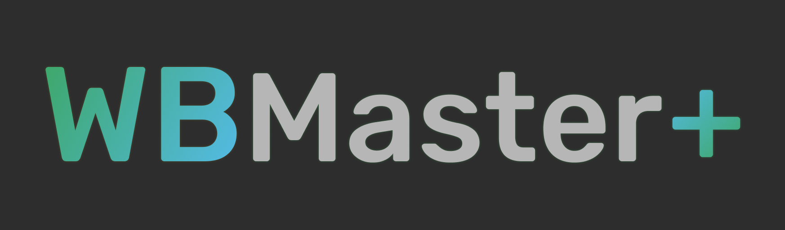

# WBMaster+

**Work Breakdown Master Plus**

A web tool to simplyfy work breakdown. You can try it [here](http://wbmaster.eba-rtcbmfa5.eu-central-1.elasticbeanstalk.com/).




## Requirements

- Python 3.10
- pipenv
- django

This project is built using django and pipenv. Make sure to have them installed on your pc, if it's not the case you can install them using `pip`.


## Building

Running the app:
1. Install the needed packages
    ```shell
    pipenv install
    ```

1. Activate the server
    ```shell
    python manage.py runserver
    ```

1. Done! Your django server should be hosted on [http://localhost:8000](http://localhost:8000)

Always remember to make django [migrations](https://docs.djangoproject.com/en/4.1/topics/migrations/).


## Contributors

- Garonzi Marcello
- Klein Leon
